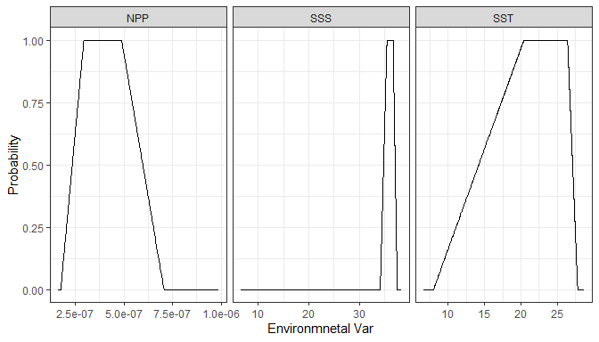
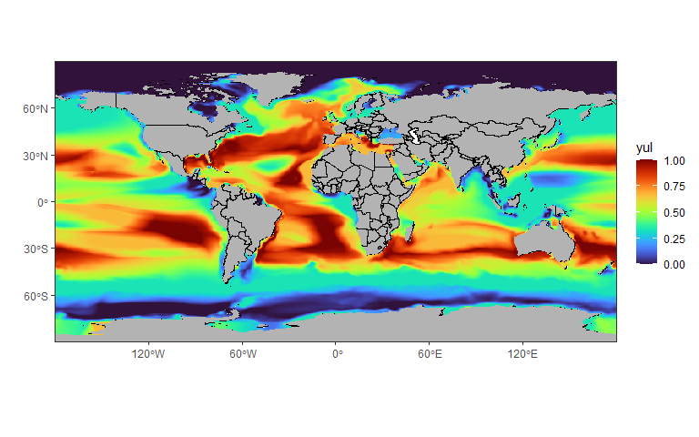
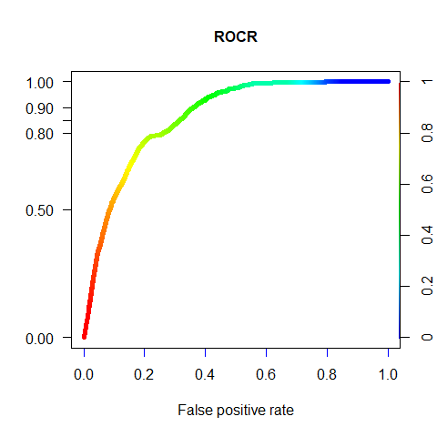

<!-- README.md is generated from README.Rmd. Please edit that file -->

# aquamean

<!-- badges: start -->
<!-- badges: end -->

The goal of `aquamean` is to compute the aquamap model {trapeze} based
on spatial occurrence and project the habitat suitability index for a
given environmental raster.

## Installation

You can install the development version of aquamean from
[GitHub](https://github.com/) with:

``` r
# install.packages("devtools")
devtools::install_github("yuliaUU/aquamean")
```

## Example

This is a basic example which shows you how to solve a common problem:

``` r
library(aquamean)
library(tidyverse)
library(rnaturalearthdata) # to get world map for plotting
library(sf) # for plotting spatial data
library(ROCR) # for getting AUC curve
```

## Use of `aquatrap` function

``` r
#test data
x <-which(test_data$occurance==1)
ENV<-test_data[x,4:6]

myAquaOut <- aquatrap(ENV, quant = c(.01, 0.25, 0.75, 0.99))
```

To visualize the trapeze probability function for each environmental
data:

``` r
# check how all trapeze ENV variables look like:
# environmental variables as a trapezoid function
x <- myAquaOut$trap.env %>%pivot_longer( cols = everything())
y <- myAquaOut$env %>%pivot_longer( cols = everything()) 
trap <- x %>%mutate(x=y$value)
#plot trap variables
ggplot(trap)+geom_line(aes(x,value))+
  facet_wrap(~ name,scales ="free_x")+
  labs(x="Environmnetal Var", y="Probability")+
  theme_bw()
#> Warning: Removed 2 row(s) containing missing values (geom_path).
```

<!-- -->

## Use of `aquatrap_pred` function

``` r
ENV_new<-test_data[,4:6]
pred_newENV <- aquatrap_pred(ENV_new, myAquaOut)
```
get HSI index for the predicted set of environemntal data
``` r
data_tsi<- cbind(test_data, yul= pred_newENV$yul)
# get continents map
world <- rnaturalearth::ne_countries(scale = "medium", returnclass = "sf")  # add continents
sf_use_s2(FALSE)
#> Spherical geometry (s2) switched off
# world map
map <- ggplot(data = world) + 
  geom_sf(color = "black", fill = "grey70")+
  scale_x_continuous(breaks = seq(from = -180, to = 180, by = 60)) +
  scale_y_continuous(breaks = seq(from = -90, to = 90, by = 30)) +
  theme_bw() +
  coord_sf(expand = FALSE)

# plot the data
map + 
  geom_raster(data = data_tsi, aes(x = Lon, y = Lat, fill= yul))+
  viridis::scale_fill_viridis(option = "H", na.value = NA)+ labs(x="",y="")
#> Warning: Removed 79292 rows containing missing values (geom_raster).
```

<!-- -->

## ROCR curve

To get a ROC curve for your model

``` r
tbl<- cbind(yul= pred_newENV$yul, test_data[,3])%>%
  mutate(occurance=as.numeric(ifelse(is.na(occurance),0, occurance)))%>%
  drop_na()
summary(tbl)
#>       yul           occurance      
#>  Min.   :0.0000   Min.   :0.00000  
#>  1st Qu.:0.2045   1st Qu.:0.00000  
#>  Median :0.4189   Median :0.00000  
#>  Mean   :0.4317   Mean   :0.01478  
#>  3rd Qu.:0.6667   3rd Qu.:0.00000  
#>  Max.   :1.0000   Max.   :1.00000
ROC_curve <- ROCR::prediction(tbl[[1]], tbl[[2]])
AUC <- ROCR::performance( ROC_curve, "tpr", "fpr")

plot(AUC, main="ROCR", colorize=TRUE,
     ylab="", box.lty=7, box.lwd=1,
     box.col="black", lwd=5, colorkey.relwidth=0.1, xaxis.cex.axis=1,
     xaxis.col='blue', xaxis.col.axis="black", yaxis.col='black', yaxis.cex.axis=1,
     yaxis.at=c(0,0.5,0.8,0.85,0.9,1), yaxis.las=1, xaxis.lwd=1, yaxis.lwd=1,
     yaxis.col.axis="black", cex.lab=1, cex.main=1)
```

<!-- -->
Get AUC score
``` r
AUC <- ROCR::performance( ROC_curve, "auc")@y.values
print(AUC[[1]])
#> [1] 0.8608912
```
